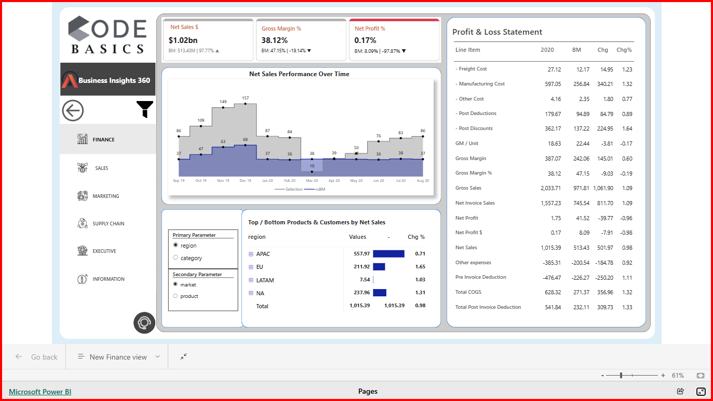
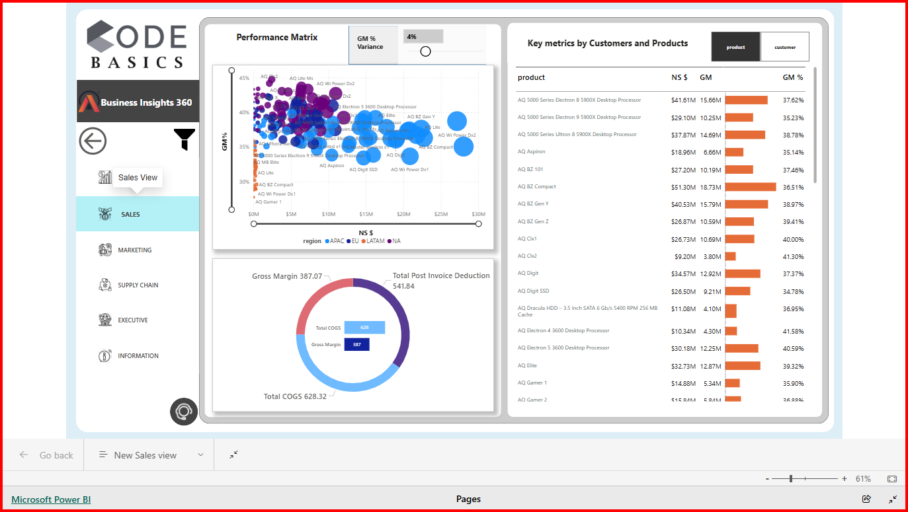
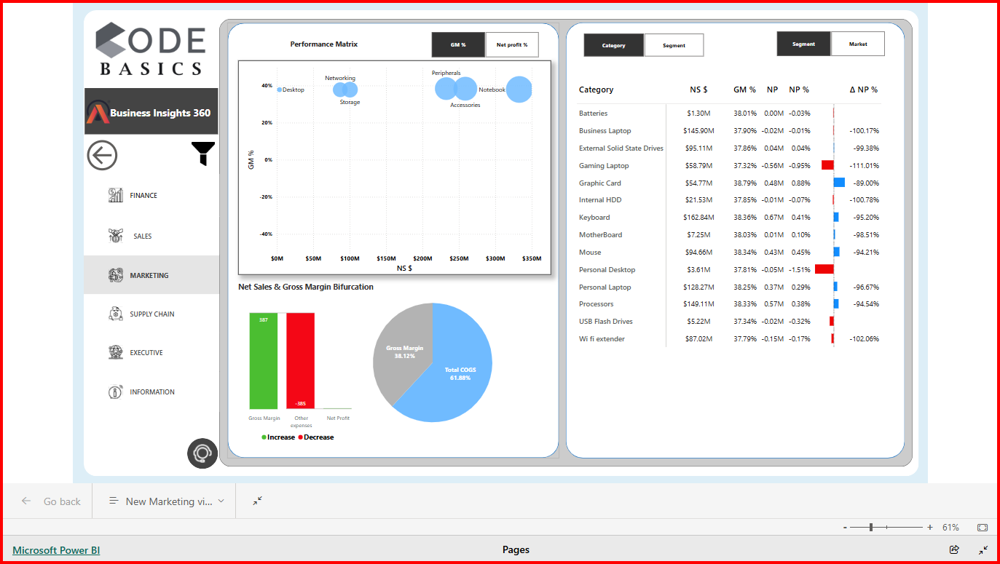
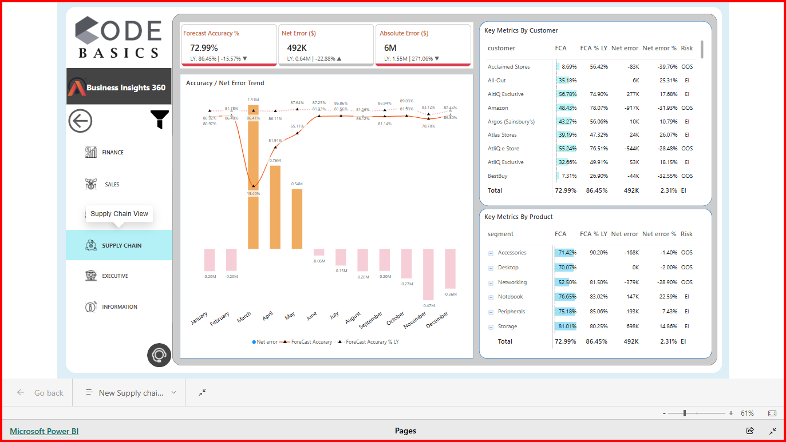
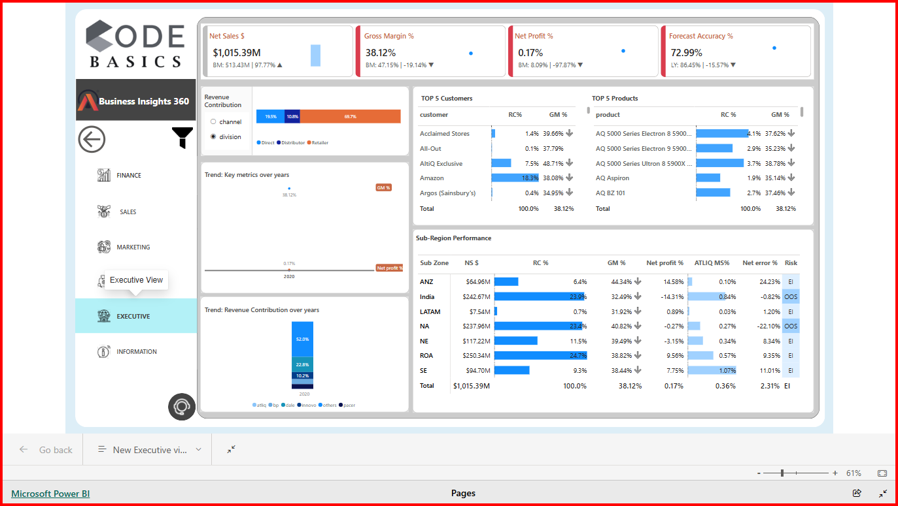

# Power BI Project: Business Insights 360 Version 2.0

👋 Hello Everyone!
Excited to share my New design of my "Business Insights 360" PowerBI report, tailored for Atliq Hardware!.📶

**Business Insights 360 - Power BI Project for AtliQ Hardware**

**Live Dashboard Link**: [Link](https://app.powerbi.com/view?r=eyJrIjoiMDZmNTIxODQtZDcyNC00ZWJhLWJhZDMtYzRhZjBlMzdmYjVkIiwidCI6ImM2ZTU0OWIzLTVmNDUtNDAzMi1hYWU5LWQ0MjQ0ZGM1YjJjNCJ9)

**Linkedin Profile Link**: [Link](https://www.linkedin.com/in/vijay-v-534666209)

Excited to update the transformation of New dashboard Design!

**Here's what's new:** 🌟
- Refreshed cards using the new card visual
- Utilized field parameters alongside slicers for seamless visual switching
- Extensively integrated bookmarks for Left-navigation, information page and support page 
- Managed object visibility and layering order efficiently using the selection pane
- Incorporated custom-designed icons and background imagery with Canva

This redesign journey has been nothing short of exhilarating, filled with exploration, creativity and abundant learning opportunities. It's remarkable how even the smallest changes can yield significant impacts! 📶✨

# Brief overview of the project:

**"Business Insights 360"** - Powered by Power BI, this comprehensive dashboard provides AtliQ Hardware with actionable insights across Finance, Sales, Marketing, Supply Chain and Executive.

This project will showcases the potential of Power BI in transforming data into actionable insights, providing AtliQ Hardware with the analytics they need for smarter business strategies

# <h3> Project Overview  </h3>
AtliQ Hardware is a hardware manufacturing company that sells various products to customers across different countries and regions.

 𝗣𝗿𝗼𝗯𝗹𝗲𝗺 𝗦𝘁𝗮𝘁𝗲𝗺𝗲𝗻𝘁 : AtliQ Technologies, a rapidly growing consumer electronics company, faced significant data analysis challenges relying solely on Excel, which proved inefficient during a major financial loss in Latin America.

𝗣𝗿𝗼𝗷𝗲𝗰𝘁 𝗚𝗼𝗮𝗹 : Leverage Power BI to enhance data analytics capabilities, addressing key financial, sales, marketing, supply chain, executive queries from stakeholders. The project utilized an extensive dataset with large number of records.

𝗧𝗼𝗼𝗹𝘀 𝗨𝘀𝗲𝗱 : SQL, Power BI Desktop, Excel, DAX language, DAX Studio (for optimizing reports)

𝗦𝗼𝗹𝘂𝘁𝗶𝗼𝗻 :
As an aspiring Data Analyst, I developed Power BI reports that deliver crucial insights for various departments—Finance, Sales, Marketing, Supply Chain and Executive. These reports track essential KPIs, enabling informed, data-driven decisions across the company.

 **<h3>Home Page</h3>** 

  

 <h3>Finance View: Financial planning and Expense Management </h3> 
Analyze Profit & Loss statements, Net Sales trends, and top-performing products and customers by various criteria.

Implemented a financial forecasting model, resulting in more accurate budget predictions. Created benchmarking against last year and target goals for budgeting.

**Finance view**

  

 <h3>Sales View: Increase sales revenue with Customer and Product Performance </h3>
Examine Customer and Product performance, with insights into Net Sales, Gross Margin %, and unit economics, including COGS and deductions.

Created customer and product overall sales performance report. Identified sales trends and track KPIs.

**Sales View**

  

 <h3>Marketing View: Implement data-driven marketing strategies</h3>
Gain a comprehensive view of Product, Market, Regional, and Customer performance, while tracking GM% and NP% across segments. Delve into unit economics with detailed COGS, operational expenses, and NP analysis.

Created region and product wise overall market performance report and unit economics. Identified market trends and track KPIs.

**Marketing view**

  

 <h3>Supply Chain View: Optimization metrics for efficient supply chain management.</h3>
Track Forecast Accuracy, Net Error, and Absolute Error metrics. Observe Accuracy and Net Error trends and review metrics by product for supply chain optimization.

Identified forecast accuracy % , net error % ,absolute error % trends. Key Metrices by customers and products demanding supply management.

**Supply Chain View**

  

 <h3>Executive View: Metrics critical for top-level decision-makers.</h3>
Developed an executive dashboard for real-time performance monitoring. Shows revenue by division, customers , products and channels.

Developed an executive dashboard for real-time performance monitoring. Shows revenue by division, customers , products and channels.

**Executive View**

  

# Skills
<h3>Power BI fundamentals</h3>
1.Creating calcualted columns and DAX measures

 2.Data Modelling ,data validation techniques and using KPI indicators

3.Using bookmarks to switch between two visuals and conditional formatting

4.Page navigation with buttons

5.Using tooltips to save page area

6.Dynamic titles based on the applied filters

7.PowerBI services for publishing and sharing reports online

8.Auto refresh setup for data through gateway

# Business Terminology
1.Net sales and Net Invoice Sales

2.Gross Margin and Gross Margin %

3.Pre invoice deductions and Post invoice deductions

4.COGS(cost of goods sold)

5.Net Profit and Net Profit %

6.Absolute Error

7.Variance and Targets

8.YTG (year to go)

9.YTD ( year to date)

10.Direct ,retailer, customer , consumer and distributors
